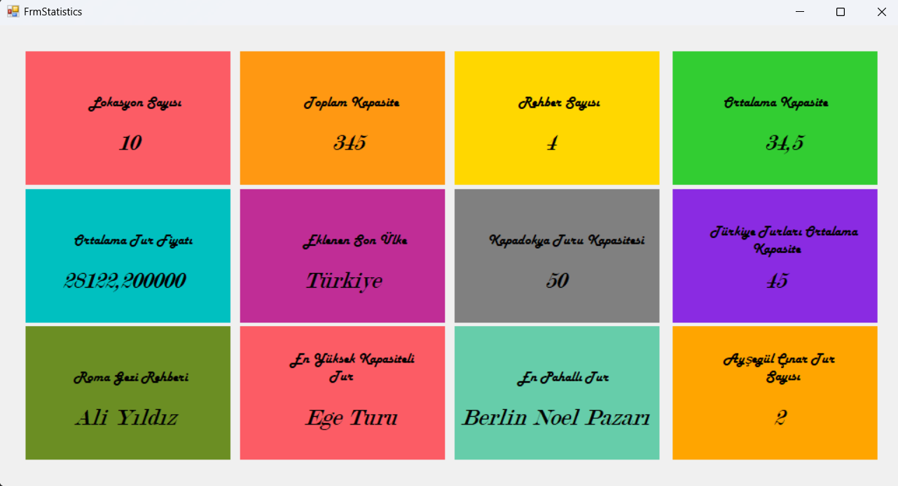

Bu proje, YouTube'da Murat Yücedağ'ın C# Eğitim Kampı'ndan OOP Modülünü içermektedir   

# CSharpEgitimKampi301.EFProject  

EgitimKampiEfTravelDb Projesi  

Bu proje, bir seyahat yönetim sistemi için hazırlanan bir Windows Forms uygulamasıdır. Veritabanı işlemlerini gerçekleştirmek için *Entity Framework* kullanılmıştır. Uygulama, rehber ve lokasyon bilgilerini yönetmek için çeşitli CRUD işlemleri ve istatistiksel raporlar sunmaktadır.  
## Ekran Görüntüsü
*FrmStatistics* ekranının çıktısı aşağıda yer almaktadır:

